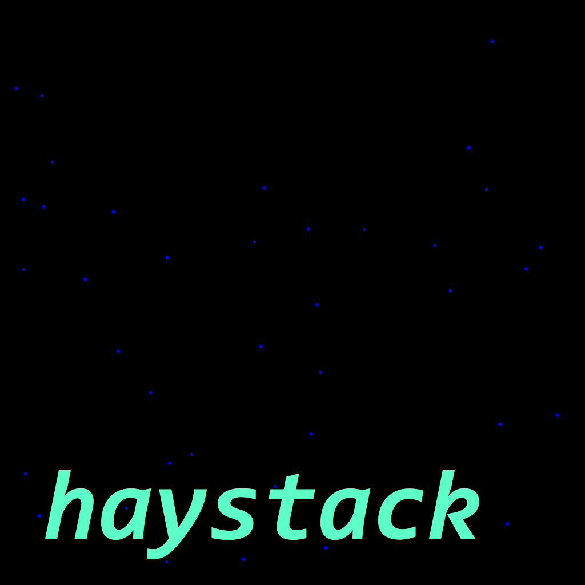
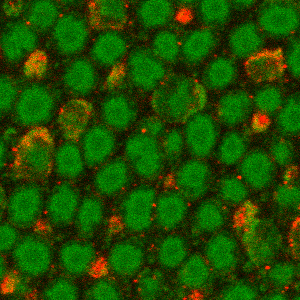
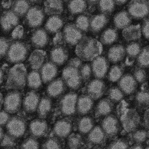
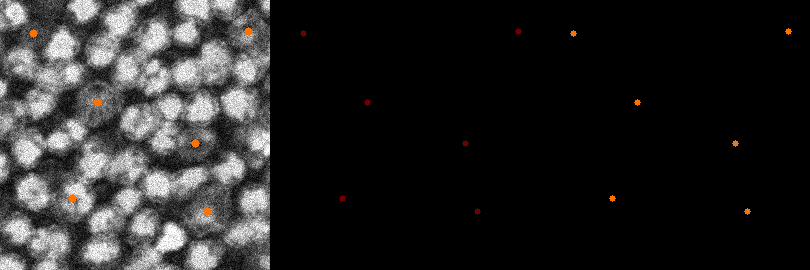
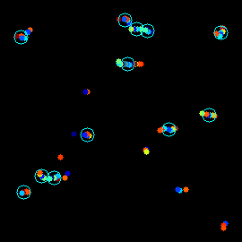
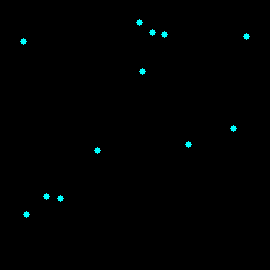

<a name="readme-top"></a>

<!-- PROJECT LOGO -->
<br />
<div align="center">
  <a href="https://github.com/thomasmichaelkane/haystack">
    
  </a>

<h3 align="center">haystack</h3>

  <p align="center">
    Finding cells in 3D stacks using cellpose and K-means clustering
    <br />
    <a href="https://github.com/thomasmichaelkane/haystack"><strong>Explore the docs »</strong></a>
    <br />
    <br />
    <a href="https://github.com/thomasmichaelkane/haystack/issues/new?labels=bug&template=bug-report---.md">Report Bug</a>
    ·
    <a href="https://github.com/thomasmichaelkane/haystack/issues/new?labels=enhancement&template=feature-request---.md">Request Feature</a>
  </p>
</div>

<!-- TABLE OF CONTENTS -->
<details>
  <summary>Table of Contents</summary>
  <ol>
    <li>
      <a href="#about-the-project">About The Project</a>
      <ul>
        <li><a href="#built-with">Built With</a></li>
      </ul>
    </li>
    <li>
      <a href="#getting-started">Getting Started</a>
      <ul>
        <li><a href="#installation">Installation</a></li>
      </ul>
    </li>
    <li><a href="#usage">Usage</a></li>
      <ul>
        <li><a href="#classes">Classes</a></li>
        <li><a href="#functions">Functions</a></li>
      </ul>
    <li><a href="#license">License</a></li>
    <li><a href="#contact">Contact</a></li>
  </ol>
</details>

<!-- ABOUT THE PROJECT -->
## About The Project

This project is for the purpose of finding the locations of cell types that pose a detection challenge for two reasons; difficulty in differentiation from other cells given the imaging method; difficulty mapping cell locations in 2D due to cells occupying a shallow 3D space and appearing at different depths.

The below example shows imaging with two channel staining (for human validation/training) and a single channel (the desired imaging method for automated cell differentiation). In the green only channel the two cell types are often seemingly indistinguishable from one another.




Haystack is built on top of cellpose to detect difficult cells such as these across a shallow 3D stack (ones where cells do not significantly overlap). Running the detection model on each slice individually allows for improved robustness and removal of false positives that do not reach a threshold. The detection process is shown below on an input stack, on a black background, and added cumulatively.



Clustering using sklearn algorithms we can then find the 'true' cells. This outputs a set of coordinates estimating the centre if each cell in a 2D representation, with significantly added robustness in detecting difficult to distinuish cells.




<p align="right">(<a href="#readme-top">back to top</a>)</p>


### Built With

* [![Python][Python.py]][Python-url]
* [![OpenCV][OpenCV.py]][OpenCV-url]
* [![Scikit-learn][Scikit-learn.py]][Scikit-learn-url]

<div align="center">
    <h2>Cellpose</h2>
    <a href="https://github.com/MouseLand/cellpose">
        
    </a>
</div>

<p align="right">(<a href="#readme-top">back to top</a>)</p>


<!-- GETTING STARTED -->
## Getting Started

To get a local copy up and running follow these simple example steps.


### Installation

1. Clone the repo at the desired location
   ```sh
   git clone https://github.com/thomasmichaelkane/haystack.git
   cd haystack
   ```
2. Create a virtual environment
   ```sh
   python -m venv .venv
   ```
2. Activate environment
  <small>Windows</small>
   ```sh
   .venv/Scripts/activate.ps1  
   ```
   <small>Mac/Linux</small>
   ```sh
   source .venv/bin/activate
   ```
3. Install prerequisites
   ```sh
   python -m pip install -r requirements.txt
   ```

<p align="right">(<a href="#readme-top">back to top</a>)</p>


<!-- USAGE EXAMPLES -->
## Usage

Included in this project is one YAML config file and two scripts, that can be used to run the haystack process. One allows for the creation of training data from stacks to use for creating cellpose models, and the other for the primary haystack functionality. An API for using the classes in your own scripts is also desctibed further on.

## Scripts

These are example scripts that can be run on the command line to use the haystack class easily. These scripts rely on settings in the config.yaml file, so these should be changed first.

### run_haystack.py

Uses the haystack class and settings in the config.yaml file to detect cells using cellpose (or load rois directoly), cluster, and save all processing outputs.

```sh
python run_haystack.py path/to/stack [rois_exist]
```
- *Arguments:*
  - `path/to/stack` (path): The path to the image stack. This can be a path to a directory containing individual images, or to a single file tiff stack.
  - `rois_exists` (bool, optional): Whether cellpose has already been run and the ROIs already exist in the same directory. The default is False.

### random_subsect.py

Create random small subsections of images from a stack for using as training data in cellpose to create detection models for the haystack class.

```sh
python random_subsect.py path/to/stack [num_squares] [size]
```
- *Arguments:*
  - `path/to/stack` (path): The path to the image stack. This can be a path to a directory containing individual images, or to a single file tiff stack.
  - `num_squares` (int, optional): The number of squares to cut from each slice. The default is 1.
  - `size` (int, optional): The siz eof each square (pixels) to be cut. The default is 300px.


<p align="right">(<a href="#readme-top">back to top</a>)</p>

## API


### Class: Haystack

The haystack class is built by loading an image stack into the object. The class can then be used to detect cells in the stack using cellpose models, cluster these using sklearn algorithms, show videos and images of these processes, and save clustered cell positions that represent a flattened 2D representation of the cells from the shallow 3D space input.

The class can be imported like so:

```py
from haystack import Haystack
```

---

#### Constructor

```py
__init__(path):
```
The class is constructed by loading a tiff stack or an image directory.

- *Parameters:*
  - `path` (str): The path to the image stack. This can be a path to a directory containing individual images, or to a single file tiff stack.

---

#### Methods

```py
choose_colormap(cm):
```

Assign a different colormap for cell detections. The default is 'jet'.

- *Parameters:*
  - `cm` (str): The name of the colormap to be used.

---

```py
load_rois_directly(roi_path=None):
```
If ROIs already exist they can be loaded directly without rerunning the cellpose algorithm.

- *Parameters:*
  - `roi_path` (str, optional): The path to the region of interest (ROI) directory. If not provided, ROIs are expected to be in the same directory as the image stacks.

---

```py
write_images_dir():
```
Creates a directory of images from a loaded stack (needed for the cellpose algorithm).

---

```py
detect_cells(model_path, cellprob_threshold, channels):
```
Detect cells using the cellpose algorithm. Check the cellpose documentation for details on the model and attributes.

- *Parameters:*
  - `model_path` (str): The path to the cell detection model.
  - `cellprob_threshold` (float): The threshold for cell probability.
  - `channels` (list of str): List of the channel names.

---

```py
cluster_cells(min_samples, max_clustering_distance):
```
Use cell detection across layers to find clusters using a max distance between detections and a minimum number of samples.

- *Parameters:*
  - `min_samples` (int): The number of detections in a neighborhood for a cluster to be considered a true cell detection.
  - `max_clustering_distance` (float): The maximum distance between two detections for one to be considered as in the neighborhood of the other.

---

```py
show_stack(fps=8):
```
Plays the raw stack as a video for visualization.
- *Parameters:*
  - `fps` (int, optional): Frames per second for display (default is 8).

---

```py
show_detections_stack(on_frames=False, fps=8):
```
Plays all detections as a video for visualization, either on a black background or on the stack itself.

- *Parameters:*
  - `on_frames` (bool, optional): Indicates if detections should be overlaid on frames (default is False).
  - `fps` (int, optional): Frames per second for display (default is 8).

---

```py
show_cumulative_stack(fps=8):
```
Plays all detections as a video for visualization on a black background. Detections from previous frames remain through the stack.

- *Parameters:*
  - `fps` (int, optional): Frames per second for display (default is 8).

---

```py
show_clustering():
```
Display an image with all detections and how the cells were clustered.

---

```py
show_clustered_cells():
```
Display an image with all locations of clusters.

---

```py
save_raw():
```
Saves stack of raw frames.

---

```py
save_detections_stack():
```
Saves the stack with cell detections on a black background.

---

```py
save_detections_stack_on_frames():
```
Saves the stack with cell detections overlaid on the frames.

---

```py
save_cumulative_stack():
```
Saves the stack with cumulative cell detections on a black background.

---

```py
save_clustering_image():
```
Saves an image showering the clustering process.

---

```py
save_clustered_cells_image():
```

Saves an image with cells from cluster centres.

---

```py
save_all_processing_images(save_raw=False):
```

Save all function for all the images and stacks showing the processing steps.

- **Parameters:**
  - `save_raw` (bool, optional): Indicates if raw images should be saved as well(default is False).

---

```py
save_cells_as_coords():
```

Saves the cell coordinates from cluster centres as a .txt file.

---

<p align="right">(<a href="#readme-top">back to top</a>)</p>

### Class: SubsectionGenerator

A class for taking random image samples of a set size from a tiff stack or a directory of images. For creating images for training data for cellpose model training.

The class can be imported like so:

```py
from haystack import SubsectionGenerator
```

---

#### Constructor

```py
__init__(path, square_size):
``` 
- *Parameters:*
  - `path` (str): The path to the image stack. This can be a path to a directory containing individual images, or to a single file tiff stack.
  - `square_size` (int): The size of the random image samples (pixels) to be cut from the original image. It is reccomended that this is not too close to the original image size to avoid too much duplication of sections in training data.

---

#### Methods

```py
make_Samples(squares_per_slice):
```
Cuta set number of random image samples from the stack.
- *Parameters:*
  - `squares_per_slice` (int): The number of random image samples to be cut from each slice of the stack.

---

### Functions

Loading the configuration file. This will load all additional settings from the config.yaml file into a dictionary called *config*.

   ```py
   from haystack import load_config

   config = load_config()
   ```

<p align="right">(<a href="#readme-top">back to top</a>)</p>

<!-- LICENSE -->
## License

Distributed under the MIT License. See `LICENSE.txt` for more information.

<p align="right">(<a href="#readme-top">back to top</a>)</p>


<!-- CONTACT -->
## Contact

Thomas Kane - thomas.kane.ucl@gmail.com

Me: https://thomasmichaelkane.github.io/me/

Project Link: [https://github.com/thomasmichaelkane/haystack](https://github.com/thomasmichaelkane/haystack)

<p align="right">(<a href="#readme-top">back to top</a>)</p>


<!-- MARKDOWN LINKS & IMAGES -->
<!-- https://www.markdownguide.org/basic-syntax/#reference-style-links -->
[product-screenshot]: docs/images/screenshot.png

[Next.js]: https://img.shields.io/badge/next.js-000000?style=for-the-badge&logo=nextdotjs&logoColor=white
[Next-url]: https://nextjs.org/

[Python.py]: https://img.shields.io/badge/python-3670A0?style=for-the-badge&logo=python&logoColor=ffdd54
[Python-url]: https://www.python.org/

[OpenCV.py]: https://img.shields.io/badge/opencv-%23white.svg?style=for-the-badge&logo=opencv&logoColor=white
[OpenCV-url]: https://opencv.org/

[Matplotlib.py]: https://img.shields.io/badge/Matplotlib-%23ffffff.svg?style=for-the-badge&logo=Matplotlib&logoColor=black
[Matplotlib-url]: https://matplotlib.org/

[scikit-learn.py]: https://img.shields.io/badge/scikit--learn-%23F7931E.svg?style=for-the-badge&logo=scikit-learn&logoColor=white
[scikit-learn-url]: https://scikit-learn.org/stable/

[SciPy.py]: https://img.shields.io/badge/SciPy-%230C55A5.svg?style=for-the-badge&logo=scipy&logoColor=%white
[SciPy-url]: https://scipy.org/

[Arduino.ino]: https://img.shields.io/badge/-Arduino-00979D?style=for-the-badge&logo=Arduino&logoColor=white
[Arduino-url]: https://www.arduino.cc/reference/en/